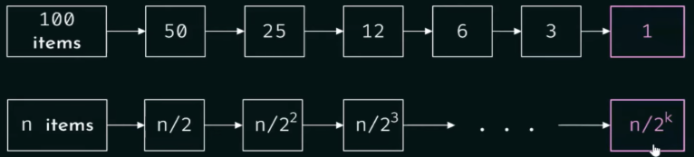
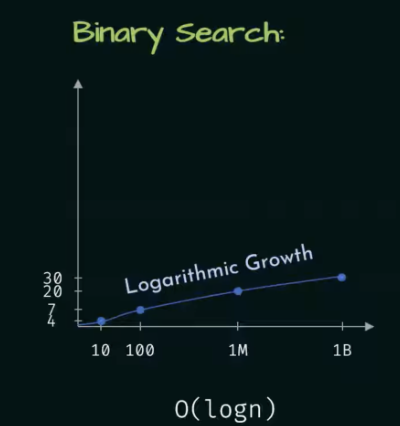
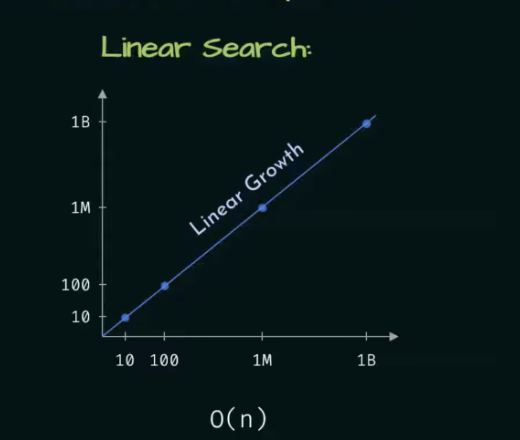

# Day - 12

## Big O notation and binary Search

* Big O notation of binary search.
* Growth rate of binary search.
* Growth rate comparison of linear search and binary search.

In binary search every half of the list is eliminated.

### Binary search:

| Number of items | Number of comparison |
| :--- | :--- |
| 10 | 3 |
| 100 | 7 |
| 1 billion | 30 |
| $n$ | $\log n$ |

---

#### Elimination Process Visualization

---
### Mathematical Derivation
$$\frac{n}{2^k} = 1$$
$$\rightarrow 2^k = n$$
$$\rightarrow \log_2 2^k = \log_2 n$$
$$\rightarrow K = \log_2 n$$

**Time complexity : O(log n)**

---

### Growth Rate of Binary Search

---

### Growth Rate Comparison

| Linear Search: $O(n)$ | Binary Search: $O(\log n)$ |
| :--- | :--- |
|  |  |